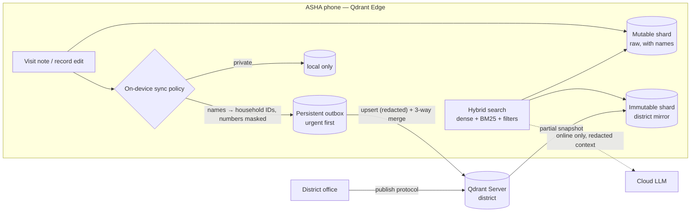

# Smriti — memory that works without a signal

**स्मृति (smriti) means “memory”.** India's ~10 lakh ASHA workers keep track of every pregnancy, newborn and fever in their village — often where there is no mobile signal, and always with data that should not leave the phone.

Smriti is an offline-first AI memory for frontline health workers. Every device carries its own **Qdrant Edge** shard: visit notes, household records and health protocols are searchable in about a millisecond with no network. When a connection appears, Smriti decides on the device what may leave it, sends danger signs first, merges conflicting edits from other workers, and pulls down district updates.

Built for the Qdrant Edge problem statement at **Code Cubicle 6.0**.

## The edge-to-cloud workflow



- **Two shards per device**, following Qdrant's edge synchronisation pattern: a *mutable* shard for everything written on the device, and an *immutable* shard that mirrors the district server through **partial snapshots** (`snapshot_manifest()` → `POST …/snapshot/partial/create` → `update_from_snapshot()`). Queries run on both and merge on-device.
- **Hybrid search offline**: a small ONNX sentence model (`bge-small-en-v1.5`, via FastEmbed) for meaning plus Qdrant Edge's **built-in BM25** for exact terms, fused with RRF.
- **Payload filters, parsed on-device**: “urgent notes about Meena this week” becomes `household = HH-014 · priority = urgent · kind = note · timestamp ≥ 7 days`. The name resolves through the phone's own register, so this works offline. Filtered fields are payload-indexed on the edge shard.
- **Deciding what stays local** — on the device, before anything is queued:
  - registered names become household IDs and phone/Aadhaar numbers are masked; the raw note never leaves the phone;
  - notes semantically close to a danger sign (e.g. *severe headache with blurred vision in pregnancy*) are marked **urgent and sync first**;
  - notes marked private never sync.
- **Intermittent connectivity**: the outbox is SQLite, so nothing is lost if the app closes offline.
- **Conflicting information**: household records use optimistic concurrency with a **field-level three-way merge**. Changes to different fields merge automatically; the same field changed differently on two devices is kept as a visible conflict with both values and authors until someone resolves it — and the resolution syncs like any other edit.
- **Cloud → edge**: the district publishes a protocol (e.g. a heatwave advisory) to the server; every device receives it on its next partial snapshot and can search it offline.
- **Cloud AI, privacy-preserving**: retrieval always happens on the device. When online, a cloud model can write an answer from the top results — but it only ever receives redacted text, and the UI shows exactly what was sent. Offline, Smriti answers from memory alone.

## Measured on-device

A fresh Edge shard filled with realistic visit notes (`POST /api/benchmark`, MacBook, CPU only):

| | |
|---|---|
| Memories | 10,000 |
| HNSW index build (`optimize()`, in-process) | 1.11 s |
| Hybrid search p50 / p95 | 0.343 / 0.578 ms |
| Filtered hybrid search (household + kind + last 30 days) p50 / p95 | 0.165 / 1.384 ms |
| Embedding throughput (CPU) | 183 notes/s |

## Run it

Requires [uv](https://docs.astral.sh/uv/). The Qdrant Server binary is downloaded on first run.

```bash
cp .env.example .env      # GEMINI_API_KEY is optional — only the online “ask” uses it
./run.sh                  # starts Qdrant Server 1.19 + the app on http://localhost:8000
```

The demo loads a village with two workers — Sunita (ASHA, phone) and Rekha (ANM, tablet) — and a district server.

**Try this:** switch Sunita **offline** → write *“Meena has had a severe headache and blurred vision since morning”* → see the policy decision → search *“urgent notes about Meena this week”* (sub-millisecond, no network) → on Rekha's tablet change Meena's next visit and sync → on Sunita's phone change it too → bring Sunita **online** and sync: the urgent note goes first, the conflict appears on both sides → resolve it → publish a heatwave advisory from the district and sync Rekha's tablet.

## Project layout

```
smriti/device.py    edge device: two shards, outbox, hybrid search, sync, three-way merge
smriti/policy.py    on-device sync policy (redaction, danger-sign urgency, private notes)
smriti/query.py     on-device query → Qdrant payload filters
smriti/server.py    district collection, protocol publishing, overview
smriti/cloud_ai.py  optional cloud answer over redacted context
smriti/bench.py     on-device scale test
web/index.html      the interface (no external requests — it works offline too)
```

## Limits

- Both devices run in one process to make the demo visible side by side; each has its own shards, outbox and state on disk.
- The merge runs on the device against the server copy, without server-side transactions; two devices syncing the same record in the same instant could race.
- Name redaction uses the device's household register; names not in the register are not detected.
- Protocol texts are short sample summaries for the demo, not medical guidance.

Built with Qdrant Edge, Qdrant Server, FastEmbed, FastAPI and Gemini (optional). Coded with Claude Code.
